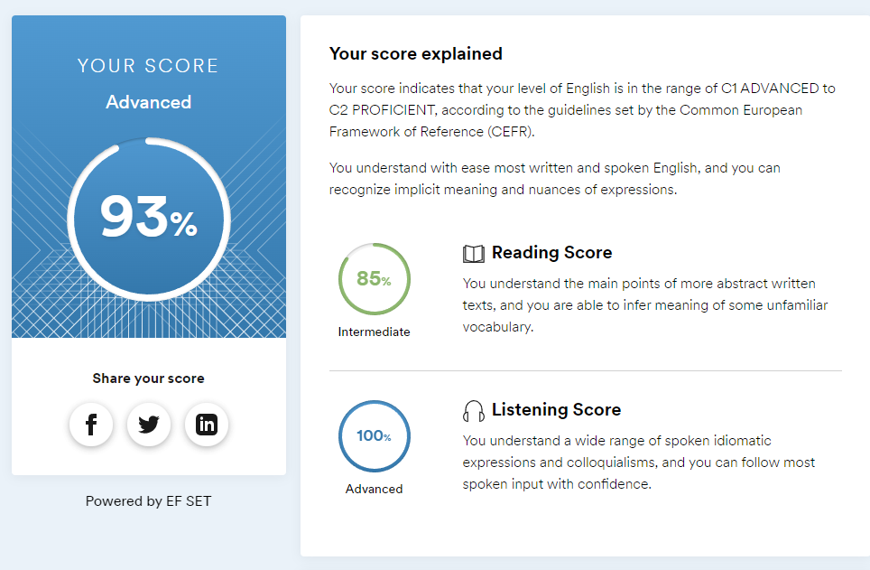

Nadya Litke            
============
##### Junior Fullstack Developer
-------------------     ----------------------------
E-mail:                         nlitke1509@gmail.com
GitHub:                   https://github.com/NadyaLE
Telegram:                                    @nlitke
Phone:                              +7 705 912 91 51
Country:                                      Russia
-------------------     ----------------------------
Education
---------
2017-2021
:   **Mathematics and Computer Science**;
Dostoevsky Omsk State University, OmSU
*Bachelor degree*
------------------------------------------
Skills and Proficiency:
-------------------------
* HTML5, CSS3
* JavaScript
* Git, CitHub
* VS Code, IntelliJ IDEA
* OOP, SOLID
* Java
* Apache Maven
* JDBC
* SQL
* Junit

--------------------------
**Code example:**
Digital root is the recursive sum of all the digits in a number.
Given n, take the sum of the digits of n. If that value has more than one digit, continue reducing in this way until a single-digit number is produced. The input will be a non-negative integer.
```javascript
function digitalRoot(n) {
    do{
        n = String(n).split("").reduce((accumulator, currentValue) => Number(accumulator) + Number(currentValue));
    }while(n >= 10)
    return n;
}
```
__________________________
**Briefly About Myself:**
Received a bachelor's degree in Mathematics and Computer Science. I entered the magistracy and now I am looking for a job with the ability to combine one with the other, at the university I acquired extensive knowledge in various fields of computer science. The decision to develop in web development came when I created my own [project](https://github.com/NadyaLE/Web) as part of a web programming course. I easily learn new things and am diligent in learning.

**Human Languages:**
* Russian (native speaker)
* English (B2 - Upper Intermediate) 

According to the online test at [EF SET](https://www.efset.org)
